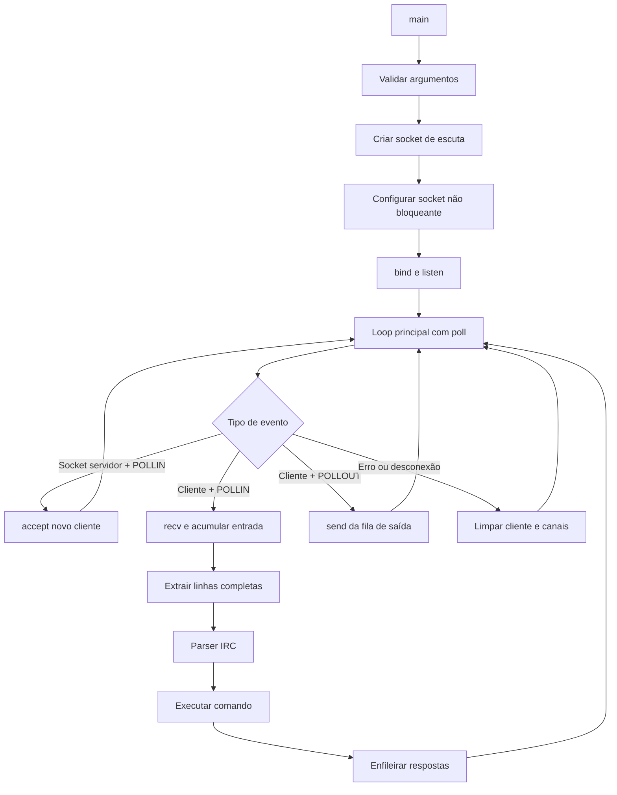
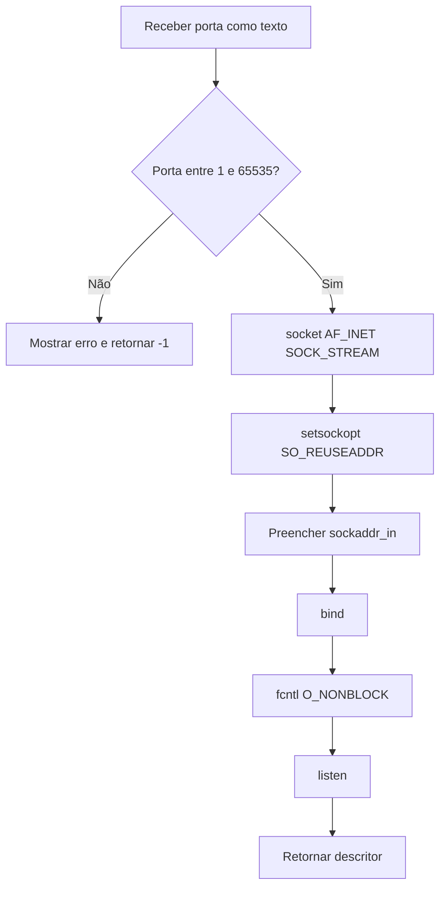
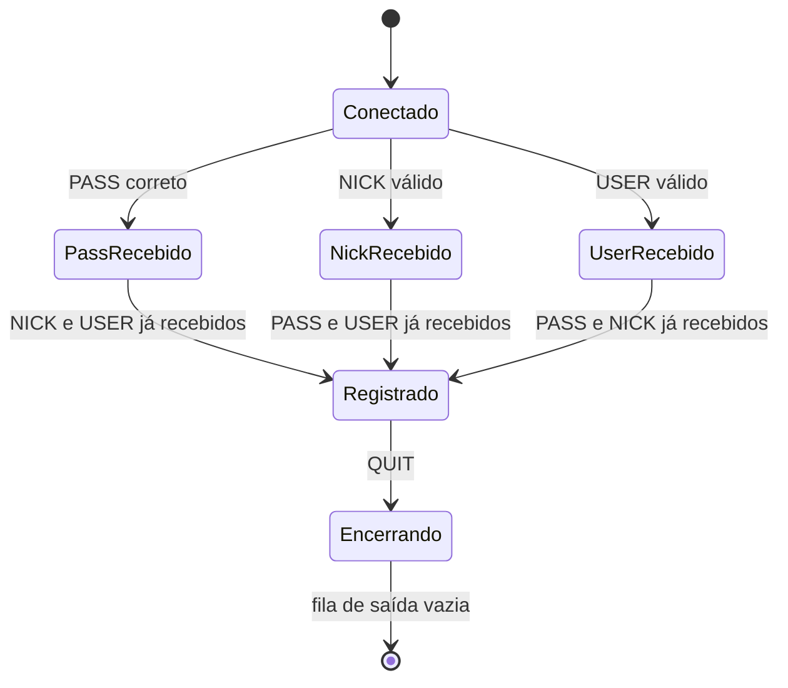
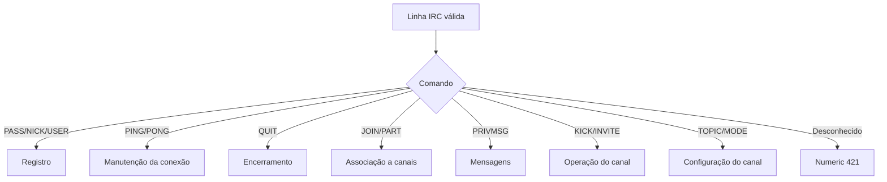
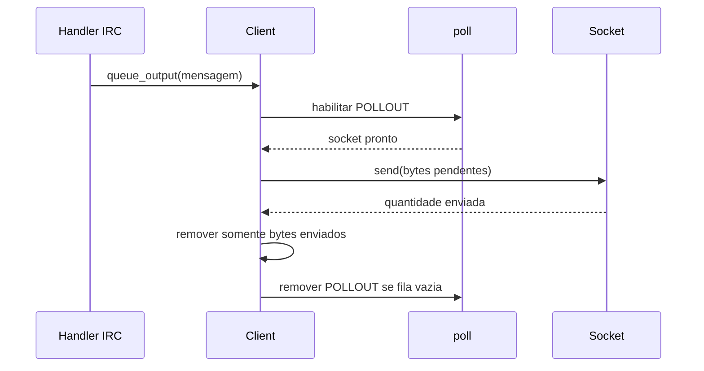
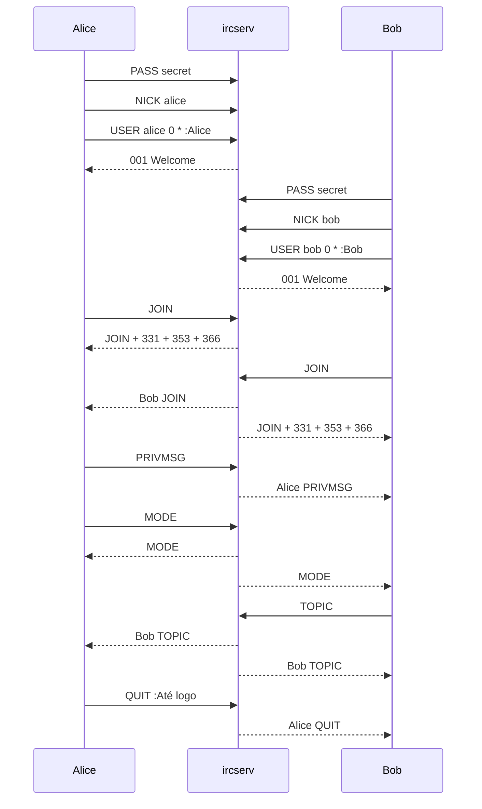

# Fluxo de funcionamento do `ft_irc`

## 1. Visão geral

O programa é um servidor IRC TCP não bloqueante escrito em C++98. Um único loop baseado em `poll()` controla:

- o socket que aceita novas conexões;
- a leitura dos clientes com `POLLIN`;
- a escrita das respostas com `POLLOUT`;
- erros, encerramentos e desconexões.

Fluxo resumido:



## 2. Entrada do programa

O ponto de entrada está em `main.cpp`.

Execução esperada:

```bash
./ircserv <porta> <senha>
```

Exemplo:

```bash
./ircserv 6667 secret
```

O `main()` executa esta sequência:

1. confirma que foram recebidos exatamente dois argumentos;
2. rejeita senha vazia;
3. configura `SIGPIPE` para não encerrar o servidor durante uma escrita;
4. configura `SIGINT` e `SIGTERM` para encerramento controlado;
5. chama `create_listening_socket()`;
6. inicia `boucle_principale()` com o socket e a senha;
7. fecha o socket de escuta quando o loop termina;
8. devolve o status final ao sistema operacional.

## 3. Criação do socket de escuta

A função `create_listening_socket()` está em `create_listening_socket.cpp`.

Fluxo:



Propriedades importantes:

- comunicação TCP/IPv4;
- aceita conexões por todas as interfaces com `INADDR_ANY`;
- permite reutilizar o endereço com `SO_REUSEADDR`;
- socket configurado como não bloqueante;
- cada falha fecha o socket antes de retornar.

## 4. Objeto `Server`

O loop cria uma única instância de `Server`.

Ela contém:

```text
Server
├── senha global
├── ClientDataBase
└── mapa de Channel
```

Responsabilidades principais:

- disponibilizar a senha usada por `PASS`;
- encontrar, criar e remover canais;
- adicionar e remover clientes dos canais;
- atualizar associações após mudança de nickname;
- notificar membros que compartilham canais;
- remover canais quando ficam vazios.

## 5. Loop principal com `poll()`

O loop está em `boucle_principale.cpp`.

O vetor de `pollfd` começa contendo somente o socket de escuta:

```text
fds[0] = socket do servidor, eventos = POLLIN
```

Cada cliente aceito adiciona outro elemento:

```text
fds[n] = socket do cliente, eventos = POLLIN ou POLLIN | POLLOUT
```

O servidor usa apenas uma chamada a `poll()` para controlar todos os descritores.

### Eventos tratados

| Evento | Ação |
|---|---|
| `POLLIN` no servidor | Executa `accept()` |
| `POLLIN` no cliente | Executa `recv()` |
| `POLLOUT` no cliente | Envia parte da fila com `send()` |
| `POLLERR` | Remove a conexão com erro |
| `POLLHUP` | Remove uma conexão encerrada |
| `POLLNVAL` | Remove um descritor inválido |

## 6. Aceitação de um cliente

Quando `poll()` indica `POLLIN` no socket de escuta:

1. o servidor chama `accept()`;
2. configura o novo socket com `O_NONBLOCK`;
3. adiciona o descritor ao vetor de `pollfd`;
4. cria um `Client` pendente no `ClientDataBase`;
5. começa a monitorar o cliente com `POLLIN`.

O servidor não envia perguntas personalizadas ao conectar. Ele espera comandos IRC.

## 7. Estrutura de um `Client`

Cada cliente armazena:

- nickname;
- username;
- realname;
- estado de `PASS`;
- estado de `NICK`;
- estado de `USER`;
- indicação de registro concluído;
- indicação de fechamento pendente;
- buffer de entrada;
- fila de saída;
- conjunto de canais;
- limite e estado de estouro da fila de saída.

Estados principais do registro:



Os comandos de registro podem chegar em ordens diferentes. `try_registration()` verifica se os três requisitos já foram satisfeitos.

## 8. Leitura com `POLLIN`

Quando um cliente possui `POLLIN`, o loop chama `handle_client_data()`.

A função:

1. executa um único `recv()`;
2. diferencia dados, EOF e erro;
3. adiciona exatamente a quantidade recebida ao buffer do cliente;
4. impede que uma entrada incompleta cresça além do limite configurado;
5. extrai todas as linhas completas terminadas em `\n`;
6. remove o `\r` final, quando presente;
7. preserva o fragmento incompleto para o próximo `recv()`;
8. envia cada linha completa ao parser IRC.

### Exemplo de comando fragmentado

Primeiro pacote:

```text
PRIV
```

Segundo pacote:

```text
MSG #geral :Olá\r\n
```

Buffer reconstruído:

```text
PRIVMSG #geral :Olá\r\n
```

### Exemplo de vários comandos em um pacote

Entrada recebida:

```text
PASS secret\r\nNICK alice\r\nUSER alice 0 * :Alice\r\n
```

Linhas processadas, em ordem:

```text
PASS secret
NICK alice
USER alice 0 * :Alice
```

## 9. Parser IRC

A classe `IRCCommand` recebe uma linha e separa:

```text
[:prefixo] COMANDO parametro parametro :parâmetro final com espaços
```

Exemplo:

```text
:alice!alice@localhost PRIVMSG #geral :Olá a todos
```

Resultado:

```text
prefixo    = alice!alice@localhost
comando    = PRIVMSG
parâmetro0 = #geral
parâmetro1 = Olá a todos
```

O comando é convertido para letras maiúsculas. Assim, `nick`, `Nick` e `NICK` são interpretados como `NICK`.

## 10. Registro IRC

Um registro comum é:

```text
PASS secret
NICK alice
USER alice 0 * :Alice Doe
```

### `PASS`

- compara o parâmetro com a senha do `Server`;
- marca a senha como aceita;
- retorna `464` se estiver incorreta;
- retorna `462` se o cliente já estiver registrado.

### `NICK`

- valida tamanho e caracteres;
- verifica duplicidade sem diferenciar maiúsculas/minúsculas;
- armazena o nickname inicial;
- depois do registro, altera o nickname e notifica os canais.

### `USER`

- exige os quatro parâmetros esperados;
- armazena username e realname;
- não permite novo `USER` depois do registro.

### Conclusão

Quando `PASS`, `NICK` e `USER` estão válidos:

1. o cliente sai do armazenamento pendente;
2. entra no mapa de clientes registrados;
3. recebe o numeric `001`;
4. passa a poder executar comandos que exigem registro.

## 11. Roteamento de comandos

Depois do parser, `process_complete_line()` escolhe o handler apropriado.



Antes do registro, comandos que precisam de autenticação recebem `451`.

## 12. Fluxo de `JOIN`

Exemplo:

```text
JOIN #geral senhaCanal
```

Validações:

1. nome do canal válido;
2. usuário ainda não está no canal;
3. convite existe quando o canal possui `+i`;
4. chave está correta quando o canal possui `+k`;
5. limite ainda não foi atingido quando existe `+l`.

Se o canal não existir:

1. ele é criado;
2. o cliente é adicionado;
3. o primeiro membro torna-se operador.

Depois da entrada:

1. o evento `JOIN` é transmitido;
2. `331` ou `332` informa o tópico;
3. `353` informa os membros;
4. `366` encerra a lista de nomes.

O cliente pode pertencer a vários canais simultaneamente.

## 13. Fluxo de `PRIVMSG`

### Mensagem para usuário

```text
PRIVMSG bob :Olá Bob
```

Fluxo:

1. procura Bob no banco de clientes;
2. monta o prefixo de Alice;
3. coloca a mensagem na fila de saída de Bob;
4. ativa `POLLOUT` para Bob no próximo ciclo.

### Mensagem para canal

```text
PRIVMSG #geral :Olá canal
```

Fluxo:

1. localiza o canal;
2. confirma que o remetente é membro;
3. percorre os outros membros;
4. adiciona a mensagem à fila de cada destinatário;
5. não devolve a mensagem ao remetente.

## 14. Estrutura de um `Channel`

Cada canal contém:

```text
Channel
├── nome
├── tópico
├── membros
├── operadores
├── convidados
├── modo i: somente convidados
├── modo t: tópico restrito
├── modo k: chave
└── modo l: limite de usuários
```

O primeiro membro recebe privilégio de operador.

Quando o último membro sai, o `Server` remove o canal.

## 15. Comandos de operador

### `INVITE`

```text
INVITE bob #geral
```

- exige que o autor pertença ao canal;
- exige privilégio de operador;
- rejeita usuário inexistente ou já presente;
- adiciona Bob aos convidados;
- envia `341` ao operador;
- envia o evento `INVITE` a Bob.

### `KICK`

```text
KICK #geral bob :Motivo
```

- exige privilégio de operador;
- confirma que Bob pertence ao canal;
- transmite o evento a todos;
- remove Bob do canal;
- apaga o canal se ele ficar vazio.

### `TOPIC`

Consulta:

```text
TOPIC #geral
```

Alteração:

```text
TOPIC #geral :Novo tópico
```

Com `+t`, somente operadores podem alterar o tópico.

### `MODE`

Consulta:

```text
MODE #geral
```

Alterações:

```text
MODE #geral +i
MODE #geral +t
MODE #geral +k senha
MODE #geral +o bob
MODE #geral +l 10
```

O parser de modos percorre cada caractere e consome os parâmetros necessários na mesma ordem.

## 16. Escrita com `POLLOUT`

Nenhum handler chama `send()` diretamente.

Em vez disso:

1. o handler chama `queue_message()`;
2. a mensagem é adicionada à fila do cliente;
3. o loop adiciona `POLLOUT` aos eventos monitorados;
4. `poll()` informa quando o socket aceita escrita;
5. `flush_client_output()` chama `send()` uma vez;
6. somente os bytes efetivamente enviados são removidos;
7. o restante permanece na fila;
8. quando a fila fica vazia, `POLLOUT` é desativado.



A fila é limitada a 1 MiB. Um cliente que não consome dados e ultrapassa esse limite é desconectado para não comprometer o servidor.

## 17. Fluxo de `QUIT`

Exemplo:

```text
QUIT :Até logo
```

Fluxo:

1. monta o evento `QUIT`;
2. encontra todos os membros que compartilham canais;
3. deduplica os destinatários;
4. enfileira o evento para eles;
5. remove o cliente de todos os canais;
6. enfileira uma linha `ERROR` para o próprio cliente;
7. marca o cliente como encerrando;
8. espera a fila ficar vazia por `POLLOUT`;
9. fecha o socket;
10. remove o cliente do banco e libera o nickname.

## 18. Desconexão inesperada

Uma desconexão também pode acontecer por:

- `recv()` retornando zero;
- falha de leitura ou escrita;
- `POLLHUP`;
- `POLLERR`;
- `POLLNVAL`;
- estouro da fila de saída.

Nesses casos, o servidor:

1. notifica os membros afetados com `QUIT` quando possível;
2. remove o cliente de todos os canais;
3. apaga canais vazios;
4. remove o cliente do banco;
5. fecha o descritor;
6. remove o `pollfd` do vetor.

## 19. Exemplo completo com dois clientes



## 20. Arquivos principais

| Arquivo | Responsabilidade |
|---|---|
| `main.cpp` | Argumentos, sinais e ciclo de vida |
| `create_listening_socket.cpp` | Criação, configuração, `bind` e `listen` |
| `boucle_principale.cpp` | `poll`, `accept`, `POLLOUT` e desconexões |
| `handle_client_data/handle_client_data.cpp` | `recv`, linhas, registro e comandos IRC |
| `classes/IRCCommand.*` | Parser de uma linha IRC |
| `classes/Client.*` | Estado, buffers, identidade e canais do cliente |
| `classes/DataBase.*` | Clientes pendentes e registrados |
| `classes/channel.*` | Membros, operadores, tópico e modos |
| `classes/server.hpp` | Senha, banco de clientes e mapa de canais |

## 21. Resumo para apresentação

Uma explicação curta durante a avaliação pode ser:

> O `main` valida porta e senha e cria um socket TCP não bloqueante. O loop usa um único `poll` para aceitar clientes, ler somente com `POLLIN` e escrever somente com `POLLOUT`. Cada cliente possui buffers de entrada e saída. A entrada é acumulada até formar linhas IRC completas, que são interpretadas por `IRCCommand` e encaminhadas ao handler correspondente. Os handlers alteram o estado do servidor e apenas enfileiram respostas. O loop envia essas filas sem bloquear e preserva envios parciais. Clientes podem participar de vários canais, que armazenam membros, operadores, tópico, convites, chave e limite. Ao desconectar, todas as associações são removidas e canais vazios são apagados.
